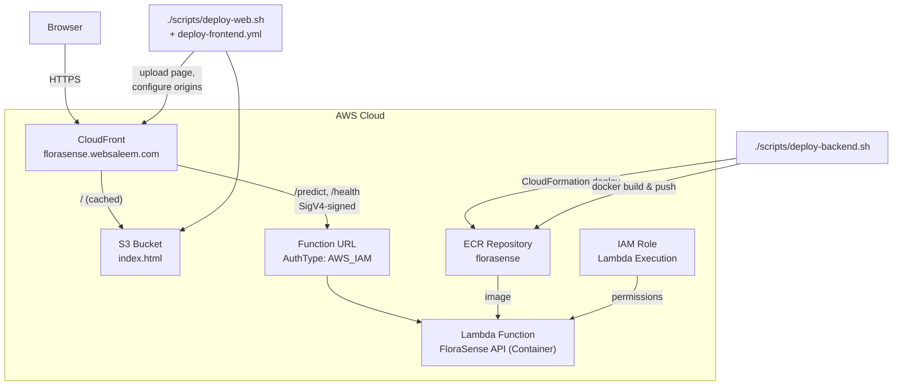

# FloraSense

AI-powered flower species identification built with PyTorch and FastAPI, deployed on AWS Lambda as a container image.

FloraSense uses deep learning models trained on the [102 Category Flower Dataset](https://s3.amazonaws.com/content.udacity-data.com/nd089/flower_data.tar.gz) to identify flower species from photographs. Upload a flower image and get instant top-K predictions with confidence scores.

This project was completed as part of RMIT's AI Programming with Python Nanodegree (conducted by Udacity).

## Project Structure

```
backend/lambda/     FastAPI handler, shared model utilities, Dockerfile
training/           Training, CLI prediction, and evaluation scripts
website/            Static web UI (S3 + CloudFront)
infra/              CloudFormation templates
scripts/            Deployment scripts
tests/              Pytest suite
checkpoints/        Trained model weights (gitignored)
data/flowers/       Training dataset (gitignored)
```

`backend/lambda/model_utils.py` is the single source of truth for architecture
construction, checkpoint resolution, preprocessing, and inference — it ships
inside the Lambda image, and the training scripts import it from there via
`training/_paths.py` rather than keeping a second copy.

## Table Of Contents

- [Project Structure](#project-structure)
- [Supported Models](#supported-models)
- [Training](#training)
- [CLI Prediction](#cli-prediction)
- [Testing](#testing)
- [AWS Deployment](#aws-deployment)
- [Web Front End](#web-front-end)
- [Continuous Integration](#continuous-integration)
- [API Endpoints](#api-endpoints)
- [Architecture](#architecture)
- [Model Checkpoints](#model-checkpoints)
- [Dependencies](#dependencies)

## Supported Models

| Architecture | Description |
|-------------|-------------|
| `vgg16` | VGG-16 (default) — good accuracy, larger model |
| `densenet121` | DenseNet-121 — compact, efficient |
| `efficientnet_b0` | EfficientNet-B0 — best accuracy/size ratio |

## Training

Train a model on the flower dataset locally before deploying:

```bash
# Install dependencies
pip3 install -r requirements-dev.txt

# Train with default settings (VGG16, 5 epochs)
python training/train.py --gpu

# Train with a specific architecture
python training/train.py --arch densenet121 --epochs 10 --gpu

# Point at a dataset somewhere other than data/flowers
python training/train.py /path/to/dataset --arch efficientnet_b0 --gpu
```

### Training Options
```
usage: train.py [-h] [--arch ARCH] [--learning_rate LEARNING_RATE]
                [--dropout DROPOUT] [--hidden_layers HIDDEN_LAYERS]
                [--epochs EPOCHS] [--gpu]
                [data_dir]

positional arguments:
  data_dir              Directory of the dataset (default: data/flowers)

options:
  -h, --help            show this help message and exit
  --arch ARCH           Choose the model architecture from ["vgg16", "densenet121", "efficientnet_b0"]
  --learning_rate LEARNING_RATE
                        Learning rate (default: 0.001)
  --dropout DROPOUT     Dropout probability in the classifier head (default: 0.2)
  --hidden_layers HIDDEN_LAYERS
                        Number of hidden layers (default: 4096)
  --epochs EPOCHS       epochs to run
  --gpu                 Use gpu if available
```

## CLI Prediction

Run predictions from the command line:

```bash
python training/predict.py path/to/flower.jpg --arch vgg16 --top_k 5 --gpu
```

### Prediction Options
```
usage: predict.py [-h] [--arch ARCH] [--top_k TOP_K]
                  [--category_names CATEGORY_NAMES] [--gpu]
                  image_path

positional arguments:
  image_path            Path to test image flower.

options:
  -h, --help            show this help message and exit
  --arch ARCH           Choose the model architecture from ["vgg16", "densenet121", "efficientnet_b0"]
  --top_k TOP_K         Returns top K predictions
  --category_names CATEGORY_NAMES
                        Path of JSON file having class name mapping.
  --gpu                 Use gpu if available
```

## Testing

The suite covers checkpoint resolution, image preprocessing, inference, and
every API route. It uses a small stand-in model rather than a trained
checkpoint, so it runs in seconds and needs no model artefacts:

```bash
pip3 install -r requirements-dev.txt
pytest tests/ -v
```

To measure real accuracy on the held-out test set (requires the dataset and at
least one trained checkpoint):

```bash
python training/test.py --gpu                  # every trained architecture
python training/test-multi-model.py flower.jpg # all models, one image, side by side
```

Both skip architectures that have no checkpoint rather than failing.

## AWS Deployment

FloraSense is deployed to AWS Lambda as a container image using CloudFormation.

### Prerequisites

- **AWS CLI** configured with appropriate permissions
- **Docker** installed and running
- A **trained model checkpoint** in `checkpoints/`. `scripts/deploy-backend.sh` picks the first
  of `checkpoint_{arch}_best.pth`, `checkpoint_{arch}_latest.pth`, or
  `checkpoint_{arch}.pth`, and bakes exactly that file into the image.

### Deploy

A single command deploys the entire stack:

```bash
./scripts/deploy-backend.sh
```

This will:
1. Deploy/update the CloudFormation stack (ECR, IAM, Lambda, Function URL)
2. Build the Docker image (with your model checkpoint baked in)
3. Push the image to ECR
4. Update the Lambda function to use the new image
5. Print the live Function URL

### Customisation

Edit the CloudFormation parameters in `scripts/deploy-backend.sh` or override them directly:

| Parameter | Default | Description |
|-----------|---------|-------------|
| `AppName` | `florasense` | Resource naming prefix |
| `ImageTag` | `latest` | Docker image tag |
| `MemorySize` | `2048` | Lambda memory in MB (512, 1024, 2048, 3072) |
| `Timeout` | `60` | Lambda timeout in seconds |
| `Arch` | `efficientnet_b0` | Model architecture to load |
| `DeployFunction` | `true` | Set to `false` to create only the ECR repository. `scripts/deploy-backend.sh` manages this automatically |
| `DevDistributionId` | *(empty)* | CloudFront distribution allowed to invoke the Function URL (dev) |
| `ProdDistributionId` | *(empty)* | CloudFront distribution allowed to invoke the Function URL (prod) |

Deploy a different architecture by setting `ARCH` in the environment:

```bash
ARCH=vgg16 ./scripts/deploy-backend.sh
```

> **Note:** VGG16 is memory-intensive. If you experience out-of-memory errors, increase `MemorySize` to `3072`.

### Tear Down

Remove all AWS resources:

```bash
aws cloudformation delete-stack --stack-name florasense-stack --region ap-southeast-2
```

Then delete the ECR images manually if needed:

```bash
aws ecr delete-repository --repository-name florasense --region ap-southeast-2 --force
```

## Web Front End

The page is served from S3 behind CloudFront, not by the Lambda. CloudFront
routes `/predict*` and `/health` to the Function URL as a second origin, so the
page and the API share one domain: the page's `fetch('/predict')` is same-origin
and no CORS configuration exists to drift. The page is also edge-cached, so a
cold Lambda no longer delays *seeing* the app — only the first prediction pays
the cold start.

Publish the page and wire up the distribution:

```bash
./scripts/deploy-web.sh --bucket dev.florasense.websaleem.com \
                        --distribution-id EXXXXXXXXXXXXX
```

The script reads the Function URL from the CloudFormation stack (or takes
`--function-url`), adds the Lambda origin, sets `DefaultRootObject`, allows POST
on the API behaviours, and invalidates the cache. Pass `--content-only` to
upload the page without touching the distribution.

Distribution ids are never hardcoded — they are scrub targets in
`expressions.txt` and are passed in as arguments or GitHub secrets.

## Continuous Integration

| Workflow | Trigger | Does |
|----------|---------|------|
| `.github/workflows/ci.yml` | push to `main`/`dev`, PRs | Runs the test suite; builds the Docker image for all three architectures; asserts the arch/checkpoint guard rejects a mismatch |
| `.github/workflows/deploy-frontend.yml` | push to `main`/`dev` touching `website/**` | Syncs the page to the matching S3 bucket and invalidates only the changed paths |

`main` deploys to production, `dev` to the dev channel. Backend image deploys
remain a deliberate manual step (`./scripts/deploy-backend.sh`).

## API Endpoints

The API is reached through the CloudFront domain. The Lambda Function URL itself
is `AWS_IAM`-authenticated and only the configured CloudFront distributions may
invoke it, so the raw `*.lambda-url.*` endpoint will reject an unsigned request —
that is what stops anyone from bypassing the CDN or running up the bill against
the origin directly.

| Method | Path       | Description                              |
|--------|------------|------------------------------------------|
| GET    | `/`        | Web UI for uploading & identifying flowers |
| POST   | `/predict` | Upload an image, returns top-K JSON      |
| GET    | `/health`  | Model status & device info               |

### Example Request

```bash
curl -X POST "https://florasense.websaleem.com/predict?top_k=5" \
  -F "file=@flower.jpg"
```

`top_k` accepts 1–102 (the number of flower categories); anything outside that
range returns a 422.

### Example Response

```json
{
  "predictions": [
    { "class_id": "21", "flower_name": "fire lily", "probability": 0.9823 },
    { "class_id": "69", "flower_name": "windflower", "probability": 0.0102 },
    { "class_id": "47", "flower_name": "marigold", "probability": 0.0041 }
  ]
}
```

## Architecture



Requests never reach the Lambda unsigned: CloudFront signs them with Origin
Access Control, and the Function URL accepts nothing else.

## Model Checkpoints

Training saves two checkpoint files into `checkpoints/`:
- `checkpoint_{arch}_best.pth` — saved whenever validation loss improves
- `checkpoint_{arch}_latest.pth` — saved at the end of training

The API loads the best checkpoint first, falling back to latest or the legacy `checkpoint_{arch}.pth` format.

## Dependencies

Install with pip:

```bash
pip3 install -r backend/lambda/requirements.txt   # runtime only
pip3 install -r requirements-dev.txt              # runtime + test tooling
```

| Package | Purpose |
|---------|---------|
| `torch` | PyTorch deep learning framework |
| `torchvision` | Pre-trained models & image transforms |
| `Pillow` | Image processing |
| `fastapi` | Web API framework |
| `mangum` | AWS Lambda adapter for ASGI apps |
| `uvicorn` | ASGI server (for local development) |
| `python-multipart` | File upload support |
| `tqdm` | Training progress bars |
