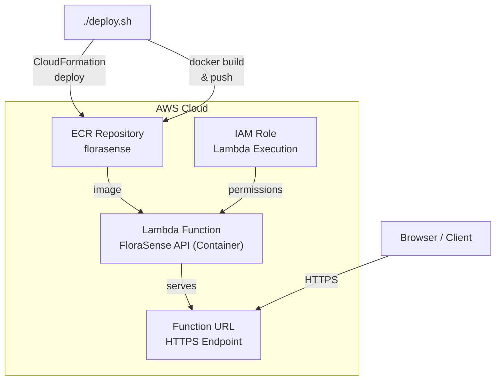

***REMOVED***

AI-powered flower species identification built with PyTorch and FastAPI, deployed on AWS Lambda as a container image.

FloraSense uses deep learning models trained on the [102 Category Flower Dataset](https://s3.amazonaws.com/content.udacity-data.com/nd089/flower_data.tar.gz) to identify flower species from photographs. Upload a flower image and get instant top-K predictions with confidence scores.

This project was completed as part of RMIT's AI Programming with Python Nanodegree (conducted by Udacity).

## Table Of Contents

- [Supported Models](#supported-models)
- [Training](#training)
- [CLI Prediction](#cli-prediction)
- [AWS Deployment](#aws-deployment)
- [API Endpoints](#api-endpoints)
- [Architecture](#architecture)
- [Model Checkpoints](#model-checkpoints)
- [Dependencies](#dependencies)

## Supported Models

| Architecture | Description |
|-------------|-------------|
| `vgg16` | VGG-16 (default) — good accuracy, larger model |
| `densenet121` | DenseNet-121 — compact, efficient |
| `efficientnet_b0` | EfficientNet-B0 — best accuracy/size ratio |

## Training

Train a model on the flower dataset locally before deploying:

```bash
# Install dependencies
pip3 install -r requirements.txt

# Train with default settings (VGG16, 5 epochs)
python train.py flowers --gpu

# Train with a specific architecture
python train.py flowers --arch densenet121 --epochs 10 --gpu
```

### Training Options
```
usage: train.py [-h] [--arch ARCH] [--learning_rate LEARNING_RATE]
                [--hidden_layers HIDDEN_LAYERS] [--epochs EPOCHS] [--gpu]
                data_dir

positional arguments:
  data_dir              Directory of the dataset (i.e. flowers)

options:
  -h, --help            show this help message and exit
  --arch ARCH           Choose the model architecture from ["vgg16", "densenet121", "efficientnet_b0"]
  --learning_rate LEARNING_RATE
                        Learning rate
  --hidden_layers HIDDEN_LAYERS
                        Number of hidden layers
  --epochs EPOCHS       epochs to run
  --gpu                 Use gpu if available
```

## CLI Prediction

Run predictions from the command line:

```bash
python predict.py path/to/flower.jpg --arch vgg16 --top_k 5 --gpu
```

### Prediction Options
```
usage: predict.py [-h] [--arch ARCH] [--top_k TOP_K]
                  [--category_names CATEGORY_NAMES] [--gpu]
                  image_path

positional arguments:
  image_path            Path to test image flower.

options:
  -h, --help            show this help message and exit
  --arch ARCH           Choose the model architecture from ["vgg16", "densenet121", "efficientnet_b0"]
  --top_k TOP_K         Returns top K predictions
  --category_names CATEGORY_NAMES
                        Path of JSON file having class name mapping.
  --gpu                 Use gpu if available
```

## AWS Deployment

FloraSense is deployed to AWS Lambda as a container image using CloudFormation.

### Prerequisites

- **AWS CLI** configured with appropriate permissions
- **Docker** installed and running
- A **trained model checkpoint** (`checkpoint_vgg16_best.pth` or similar) in the project root

### Deploy

A single command deploys the entire stack:

```bash
./deploy.sh
```

This will:
1. Deploy/update the CloudFormation stack (ECR, IAM, Lambda, Function URL)
2. Build the Docker image (with your model checkpoint baked in)
3. Push the image to ECR
4. Update the Lambda function to use the new image
5. Print the live Function URL

### Customisation

Edit the CloudFormation parameters in `deploy.sh` or override them directly:

| Parameter | Default | Description |
|-----------|---------|-------------|
| `AppName` | `florasense` | Resource naming prefix |
| `ImageTag` | `latest` | Docker image tag |
| `MemorySize` | `512` | Lambda memory in MB (512, 1024, 2048, 3072) |
| `Timeout` | `60` | Lambda timeout in seconds |
| `Arch` | `vgg16` | Model architecture to load |

> **Note:** VGG16 is memory-intensive. If you experience out-of-memory errors, increase `MemorySize` to `1024` or higher.

### Tear Down

Remove all AWS resources:

```bash
aws cloudformation delete-stack --stack-name florasense-stack --region ap-southeast-2
```

Then delete the ECR images manually if needed:

```bash
aws ecr delete-repository --repository-name florasense --region ap-southeast-2 --force
```

## API Endpoints

Once deployed, the FloraSense API is available at the Function URL printed by `deploy.sh`.

| Method | Path       | Description                              |
|--------|------------|------------------------------------------|
| GET    | `/`        | Web UI for uploading & identifying flowers |
| POST   | `/predict` | Upload an image, returns top-K JSON      |
| GET    | `/health`  | Model status & device info               |

### Example Request

```bash
curl -X POST "https://<function-url>/predict?top_k=5" \
  -F "file=@flower.jpg"
```

### Example Response

```json
{
  "predictions": [
    { "class_id": "21", "flower_name": "fire lily", "probability": 0.9823 },
    { "class_id": "69", "flower_name": "windflower", "probability": 0.0102 },
    { "class_id": "47", "flower_name": "marigold", "probability": 0.0041 }
  ]
}
```

## Architecture



## Model Checkpoints

Training saves two checkpoint files:
- `checkpoint_{arch}_best.pth` — saved whenever validation loss improves
- `checkpoint_{arch}_latest.pth` — saved at the end of training

The API loads the best checkpoint first, falling back to latest or the legacy `checkpoint_{arch}.pth` format.

## Dependencies

Install with pip:

```bash
pip3 install -r requirements.txt
```

| Package | Purpose |
|---------|---------|
| `torch` | PyTorch deep learning framework |
| `torchvision` | Pre-trained models & image transforms |
| `Pillow` | Image processing |
| `fastapi` | Web API framework |
| `mangum` | AWS Lambda adapter for ASGI apps |
| `uvicorn` | ASGI server (for local development) |
| `python-multipart` | File upload support |
| `tqdm` | Training progress bars |
